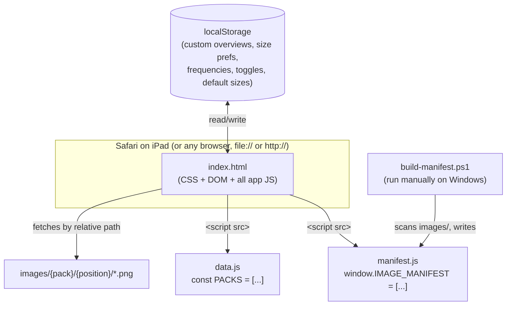

# CLAUDE.md — Range Navigator

This file is technical project documentation for an AI coding assistant (Claude Code, Codex, or similar) picking up development on this project. It assumes no prior context.

---

## 0. Schema-v2 Export Integration (2026-07-17)

New libraries produced by HRC Screenshot Exporter 2.x are **metadata-first**.
The filename is only a stable identity (`{hero}/node-000123.png`); it does not
encode positions, actions, or sizes. This fixes the architectural ambiguity in
which a suffix such as `12bb` could mean either “facing a 3-bet to 12bb” or
“taking the current 4-bet action to 12bb.”

Each new pack contains `pack.json` with `schemaVersion: 2`. Every node records:

- `navigation.path` / `pathKey` for the existing table-tap vocabulary;
- full `history` (including folds) and `navigationHistory` (non-fold actions);
- explicit `amountKind` values (`raiseTo`, `incremental`, or `none`) plus
  `amountBb` and `toBb`;
- `decision.primaryAction` and all `decision.availableActions`, including exact
  current-action sizes and child node IDs;
- node category, pot, stack behind, parent/child IDs, and `lineageNodeIds`.

`library-metadata.js` is generated beside `manifest.js` by either the exporter
or `build-manifest.ps1`. It aggregates all schema-v2 `pack.json` files into a
plain script because an offline `file://` page cannot fetch JSON reliably.
`navigator-metadata.js` contains the shared, dependency-free display helpers.

The Navigator always prefers schema-v2 metadata for a pack. `data.js` and the
NEW/OLD filename resolvers remain as a compatibility path for existing manual
libraries that have no schema-v2 metadata. Do not add filename parsing for a
new exporter feature; extend the versioned metadata schema and its consumer.

The selected metadata node is remembered per visible tap path. Descendant
resolution checks `lineageNodeIds`, so exact sized branches remain connected
even when fold-only decision nodes are omitted from the visible table path.

Regression coverage lives in the parent project:

- `tests/test_screenshot_generator.py` validates exporter metadata and indexes;
- `tests/test_range_navigator_metadata.js` validates chart labels and exact
  action trails, including `RFI 2.2bb -> 3B 12bb -> 4B 25bb`.

## 1. Project Overview

**Range Navigator** is a single-page, offline-first web app for viewing poker preflop range charts ("solver charts") on an iPad. It is a personal tool, not a published product.

### Purpose

The user studies poker preflop strategy using precomputed range charts (images exported from a solver / trainer, e.g. a 13×13 grid of starting hands showing the frequency of raise/call/fold for each combo). Rather than hunting through a folder of hundreds of images, the app lets the user **tap positions on a virtual poker table** to reconstruct a hand-history "path" (who opened, who 3-bet, who 4-bet, sizes, etc.) and the app resolves that path to the correct chart image and displays it full-screen with pinch-zoom.

### Primary goals

- Fast, tactile navigation: reproduce the action of a hand by tapping seats, in the order they'd act.
- Zero backend, zero bundler: it is static HTML/JS plus an `images/` folder, opened directly in Safari. Generated indexes are `manifest.js` and `library-metadata.js`; `navigator-metadata.js` is the pure schema-v2 consumer.
- Support multiple **packs** (different solver outputs — e.g. different open sizes, different rake structures, 6-max vs heads-up) without code changes, by auto-detecting new image folders.
- Let the user extend the chart library themselves (add images, add "overview" combined charts) **without editing code**, via an in-app CRUD manager, while still supporting a code-based workflow (`data.js` + `build-manifest.ps1`) for bulk/structured additions.

### Target users

Exactly one: the project owner, a **non-coder** studying poker on an iPad. See the "AI Handoff Notes" section for how this shapes acceptable changes (no build tooling, no dependencies, must stay a static file the user can open in Safari; every instruction to the user must be a concrete, spelled-out UI action, not "run npm install").

### Current development status

Actively maintained, feature-complete for the user's current needs, receiving incremental UX refinement (spacing, colors, labeling) rather than new architecture. Treat this as a mature, stable codebase — most requested changes are small, surgical edits to `index.html`, not rewrites.

---

## 2. High-Level Architecture

There is **no build step, no bundler, no framework, no package.json**. The entire application logic lives in one file: `range-navigator-web/index.html` (~3960 lines: inline `<style>`, inline HTML, inline `<script>`). Data lives in two sibling JS files loaded as `<script src>` tags, and images live in a plain folder tree.



### How the major components interact

1. **`manifest.js`** is a generated flat list of every image file under `images/`. **`library-metadata.js`** aggregates every schema-v2 `pack.json`. Both exist because a static `file://` page cannot enumerate directories or reliably fetch JSON, and both are regenerated by `build-manifest.ps1` or directly by the exporter.
2. **`data.js`** defines `const PACKS = [...]` — the structured navigation graph: for each "pack" (a named solver/strategy set), a list of `nodes` (path → chart image mapping) and `overviews` (named combined charts reachable via the ⋯ menu, not via the tap-path).
3. **`index.html`**'s inline script:
   - Merges `PACKS` (explicit, hand-authored) with **auto-detected packs** — any top-level folder present in `manifest.js` but not explicitly listed in `PACKS` becomes a pack automatically (`getEffectivePacks()`), so the user can create a brand-new pack by just adding an `images/{NewFolder}/...` tree and running the build script — no `data.js` edit required.
   - Renders an SVG-less, pure-DOM "poker table" (`<div class="table">` with absolutely-positioned circular buttons) representing seats (UTG/MP/CO/BTN/SB/BB for 6-max, BTN/BB for heads-up).
   - Tracks a `state.currentPath` array of "steps" (e.g. `["UTG","CO","UTG"]` = UTG opens, CO 3-bets, UTG 4-bets) built by tapping seats in order.
   - On each tap, either extends the path, or (via a naming-convention resolver) finds/synthesizes the corresponding chart node and opens a full-screen modal showing the chart image(s), with pinch-zoom/pan and multiple "variant" tabs (different bet sizes for the same spot).
   - Persists small pieces of user state (custom overviews, default sizes, default overview per position, saved fold/call/raise frequency annotations per chart, UI toggles) in `localStorage`, keyed by pack id / position / chart path — **there is no server and no account system.**

### Data flow (opening a chart)

```mermaid
sequenceDiagram
    participant User
    participant DOM as renderTable()
    participant Tap as handlePositionTap()
    participant Find as findNode() / openChartForPath()
    participant Charts as getChartsForNode()
    participant Modal as renderModal()

    User->>DOM: taps a seat button
    DOM->>Tap: handlePositionTap(pos, action?)
    Tap->>Tap: push step onto state.currentPath
    Tap->>Find: (on double-tap or explicit "View Chart") findNode(currentPath)
    Find->>Find: exact match in pack.nodes,<br/>else synthesize a node (CC/Squeeze/C4B/vs-4B patterns)
    Find->>Charts: getChartsForNode(node)
    Charts->>Charts: resolve schema-v2 node metadata first;<br/>legacy packs derive filenames from path<br/>with OLD imageBase fallback
    Charts-->>Modal: [{label, src}, ...] (one entry per bet-size variant)
    Modal->>Modal: renderActionPath() — bet-size trail chips<br/>renderBreadcrumb(), variant tabs, zoom/sequence/compare views
    Modal-->>User: full-screen chart, pinch-to-zoom
```

### Key design decisions and why they were made

- **Single static HTML file, no build tooling.** The user is a non-coder on an iPad; anything requiring `npm`/Node/a dev server is unusable to them. All edits must be plain-text edits to `index.html`/`data.js` that work immediately on file reload.
- **`manifest.js` as a generated file, not a live directory scan.** Static pages served via `file://` (as this typically is, opened directly from Explorer/Files) cannot list a folder's contents. The PowerShell script is the only "build step," and it's optional — it's only needed when images are added/renamed, not for every edit.
- **Schema-v2 metadata is authoritative; two filename conventions remain for legacy packs.** See `getChartsForNode()` in `index.html`. New exporter packs resolve `record.file`, history, and decision data from `library-metadata.js`. Only packs without schema-v2 metadata use the NEW tap-path-derived convention and OLD `node.imageBase` fallback. Both legacy resolvers must keep working for existing hand-cataloged charts, but new exporter features must not add more filename grammar.
- **In-app CRUD for "overviews" (custom charts), backed by `localStorage`**, alongside a `data.js`-based path for bulk/structured content. This lets the user add ad-hoc combined charts (e.g. "BB vs all RFI overview") from the iPad itself without ever touching a text file, which was an explicit requirement (see conversation history: "what's the easiest way to add new overviews without having to do it in the backend").
- **Everything keyed by string path arrays**, not IDs, so the same node-resolution logic can both look up explicit `data.js` nodes and synthesize virtual ones for situations that would otherwise require combinatorial explosion in `data.js` (C4B, Squeeze, vs-4B, vs-C4B, vs-Squeeze, 5-bet-in-squeeze-pot). See `openChartForPath()` and `getChartsForNode()`.

---

## 3. Folder & File Structure

```
poker preflop ios/                    ← repo root (no top-level package.json; not currently a git repo — see note below)
└── range-navigator-web/              ← the entire app lives here
    ├── index.html                    ← ENTRY POINT. All CSS + DOM + JS. Open this file to run the app.
    ├── data.js                       ← const PACKS = [...] — packs, overviews, nodes (hand-authored navigation graph)
    ├── manifest.js                   ← window.IMAGE_MANIFEST = [...] — GENERATED
    ├── library-metadata.js           ← schema-v2 pack aggregation — GENERATED
    ├── navigator-metadata.js         ← pure schema-v2 resolution/display helpers
    ├── build-manifest.ps1            ← rescans images and rebuilds both generated indexes
    ├── build-manifest.bat            ← 2-line batch wrapper so the user can double-click instead of using PowerShell directly
    └── images/
        ├── 6max_22/                  ← pack "6max 2.2bb" (id: 6max_22bb) — imageFolder must match this folder name exactly
        │   ├── UTG/  MP/  CO/  BTN/  SB/  BB/     ← one subfolder per position; a chart's file lives in its HERO's folder
        ├── 6max_2bb/                  ← auto-detected pack (folder not explicitly listed in data.js PACKS)
        │   └── (same position subfolders)
        └── HU Raked/                  ← pack "HU Raked" (id: hu_raked), format: headsUp
            ├── BTN/  BB/
            └── strategy.png           ← special: HU-only, pack-root-level "Strategy" overview button (not per-position)
```

### Responsibility of each major file

- **`index.html`** — Everything: layout/styling (CSS custom properties for per-position colors, iPad-safe touch handling, responsive breakpoints at 820px and 430px), the full DOM tree for the table/modal/manager/help UI, and all JavaScript (state, rendering, gesture handling, localStorage persistence). There is no other JS file besides the two data files below.
- **`data.js`** — Configuration and legacy/manual chart mappings. Its naming rules apply only to libraries without schema-v2 metadata. New HRC packs are indexed from their generated `pack.json` through `library-metadata.js`.
- **`manifest.js` / `library-metadata.js`** — Auto-generated. The first lists image files; the second embeds schema-v2 packs. Never hand-edit either.
- **`navigator-metadata.js`** — Pure helpers for exact chart labels, action trails, path lookup, and lineage filtering. It is intentionally dependency-free and covered by the parent project's Node regression test.
- **`build-manifest.ps1`** — Recursively scans images and direct-child `pack.json` files, rebuilding both indexes. Re-run it after manually adding, renaming, or deleting content. The exporter does this automatically when “Update Navigator indexes” is enabled.

### Entry point

Open `range-navigator-web/index.html` directly in a browser (double-click, or Safari on iPad via a file share / local server / "Add to Home Screen"). No server process, no `npm start`.

### Note on version control

The **repo root** (`poker preflop ios/`) is **not** a git repository. However, `range-navigator-web/` has its **own separate `.git/`** one level down — i.e. `range-navigator-web` is (or was) independently git-initialized, not tracked as part of a root-level repo. Run `git -C "range-navigator-web" log --oneline` to inspect its history if needed. Do not assume the two are related, and do not initialize a new root-level repo without checking with the user first, since a nested repo already exists and a root-level `git init` would not automatically absorb it.

---

## 4. Technologies

- **Language:** Vanilla JavaScript (ES6+: arrow functions, template literals, `Array.prototype.find`/`flatMap` equivalents, optional chaining `?.`, nullish coalescing not heavily used but `??` appears). No TypeScript.
- **Markup/Styling:** Plain HTML5 + CSS3 (flexbox, CSS custom properties `--x`/`--y`/`--dot-x` etc. for per-element absolute positioning, `aspect-ratio`, `backdrop-filter`, media queries). No CSS framework, no preprocessor.
- **Frameworks/libraries:** **None.** No React/Vue, no jQuery, no build tool (no Webpack/Vite/esbuild), no npm/package.json/node_modules anywhere in this project.
- **External APIs:** None. Fully offline; the only network-shaped operations are `` loads from the local filesystem/relative path.
- **Build tools:** `build-manifest.ps1` (Windows PowerShell 5.1-compatible) is the only indexing step; it writes `manifest.js` and `library-metadata.js`. There is no bundling/minification/transpilation.
- **Package manager:** None.
- **Persistence:** Browser `localStorage` only (per-origin; on `file://` this is scoped per-file-path in most browsers — be aware this can behave unexpectedly if the file is moved, and does not sync across devices without manual export, as the in-app help text says: "They sync across devices only if you back them up via data.js").

---

## 5. Configuration

There is no environment-variable system, no `.env`, no config file beyond the data files themselves.

- **Manual configuration is `data.js`; generated action-tree data is `pack.json`.** `data.js` still owns built-in overviews and legacy nodes. Schema-v2 packs supply navigation nodes through `library-metadata.js`.
- **Build/run commands:**
  - Run: open `index.html` in a browser. No compilation.
  - Regenerate manifest after image changes: double-click `build-manifest.bat` (wraps `build-manifest.ps1`).
- **Development workflow** (as documented in the in-app Help modal, `index.html` lines ~1780–1820):
  1. **In-app method (no code):** tap ⋯ on any position → "⚙ Manage overviews" → "Add new entry" → fill in label + image filename (relative to `images/{pack}/{position}/`) → place the PNG at that path → reload the page. This writes to `localStorage`, not to any file.
  2. **Code method:** drop a correctly-named PNG into `images/{pack}/{position}/`, optionally add a `nodes` entry to `data.js` (only needed if the filename doesn't follow the auto-derivable convention, or if you want a friendly `title`), run `build-manifest.ps1`, reload.
- **No secrets, no auth, no environment variables exist in this project.**

---

## 6. Features

### 6.1 Tap-path navigation (core feature)

**Purpose:** Let the user reconstruct a hand's action sequence by tapping seats, in the order they act, and see the matching range chart.

**How it works internally:**
- `state.currentPath` is an array of "step" strings. Each step is either a bare position (`"BTN"`) or a cold-call marker (`"BTN_CC"`, meaning BTN *called* rather than raised — used for squeeze-pot lines). Helpers `pathPos(step)` (strip `_CC`) and `pathIsCC(step)` decode this.
- `handlePositionTap(pos, action)` (index.html ~2425) is the central dispatcher for every seat tap. It handles: normal path extension, double-tap detection (350ms window, `DOUBLE_TAP_MS`) to open a chart or a default overview, re-entering a position already in the path (to view "vs 3-bet"/"vs 4-bet"/"vs C4-bet"/"vs Squeeze" charts), and the CC/3B "split button" positions (BTN/SB, when eligible per `canColdCall()`).
- `findNode(path)` looks for an exact `pack.nodes` match. If none exists, `openChartForPath(path)` (index.html ~2095) **synthesizes** a virtual node for known multi-step patterns that don't need an explicit `data.js` entry: 2-step CC ("cold call"), 5-step "vs Sq5B", 4-step "vs Squeeze", 4-step "vs 4B" (alternating path), 4-step "vs C4B".
- Once a node is resolved, `getChartsForNode(node)` first uses schema-v2 metadata and `navigator-metadata.js` to obtain exact files, action labels, and sizes. If that pack has no schema-v2 metadata, it runs the NEW filename resolver and then `getOldStyleCharts()`.

**Important files:** `index.html` — `handlePositionTap`, `openChartForPath`, `findNode`, `getChartsForNode`, `getOldStyleCharts`.

**Edge cases handled:**
- A position that already appears in the path can only be re-tapped if it's the **opener** (index 0) or the **3-better/caller** (index 1), and not the most recently tapped step — otherwise the tap is ignored (`handlePositionTap`'s "Guard" block, ~line 2502).
- Case-insensitive filename matching (iPad/iOS filesystems are case-sensitive; `data.js` and actual files sometimes differ in case — every manifest lookup lower-cases both sides).
- Multiple size variants of the same spot (`BTN_3B-CO-7bb.png`, `BTN_3B-CO-9bb.png`) are auto-detected and become tabs — see §6.4.

**Current limitations:** The synthetic-node patterns in `openChartForPath` are hardcoded to specific path shapes/lengths (2, 4, or 5 steps with particular CC positions). A genuinely novel action sequence (e.g. a 6-bet, or a squeeze against a squeeze) has no synthesis rule and will simply fail to open a chart — it would need a new branch added to both `openChartForPath` and `getChartsForNode`.

### 6.2 Overview charts (⋯ menu)

**Purpose:** Access combined/summary charts not reachable by any tap-path (e.g. "BB vs all RFI ranges" as one image) and let the user manage those charts entirely from the iPad.

**How it works internally:**
- Every seat has an always-visible "⋯" dot button (`overview-dot`, index.html ~3095 — deliberately unconditional; see §11 for why this was changed from conditional-on-having-overviews).
- Tapping it calls `toggleOverviewMenu(pos, dotEl, event)`, which lists `getOverviewsForPosition(pos)` — the concatenation of the pack's hardcoded `overviews` array (from `data.js`, tagged `_source: "pack"`) and the user's custom ones from `localStorage` (`getCustomOverviews`, tagged `_source: "custom"`). A "⚙ Manage overviews" button always appears at the bottom of this menu.
- "Manage" opens `#overview-manager`, a full CRUD modal (`renderOverviewManager`, index.html ~2774). Built-in (`data.js`) overviews render read-only rows (name + filename only); custom ones render editable `<input>`s for label and filename, plus a delete button. Both types get a "★" button to mark them as the **default overview** opened by a bare double-tap of that position (`getDefaultOverview`/`setDefaultOverview`, keyed `rn_def_ov_{packId}_{pos}` in `localStorage`), and a drag handle (⠿) for manual reordering (touch-only drag, `startOvDrag`/`onOvDragMove`/`onOvDragEnd`, order persisted as an array of `imageBase` values under `rn_ov_order_{packId}_{pos}`).
- Rows whose label matches `/strategy/i` are visually separated with an orange "Strategy" divider (both in the dropdown menu and the manager) — a naming convention, not a data field.

**Important files:** `index.html` — `toggleOverviewMenu`, `openOverviewChart`, `getOverviewsForPosition`, `getCustomOverviews`/`saveCustomOverviews`, `getDefaultOverview`/`setDefaultOverview`, `getOrderedOverviews`/`saveOverviewOrder`, `renderOverviewManager`, and the drag handlers. `data.js` — each pack's `overviews` array is the built-in seed data.

**Dependencies:** Purely `localStorage`; no dependency on `manifest.js` matching logic (an overview's `imageBase` is used as a literal filename, not resolved via the naming-convention parser).

**Edge cases:** Custom overviews are per-browser/per-origin `localStorage` — they do **not** sync across devices and are lost if browser data is cleared. The in-app help text explicitly warns the user of this ("sync across devices only if you back them up via data.js").

**Current limitations:** No import/export UI exists yet for custom overviews — "backing up via data.js" currently means manually copying the overview into the `data.js` source as a hardcoded entry; there's no JSON export button. See TODO/Roadmap.

### 6.3 Zoom & pan on the chart image

**Purpose:** Let the user zoom into a 13×13 hand grid to read small text/percentages.

**How it works internally:** A single global mutable object `Z = { scale, tx, ty }` (index.html ~2027) drives a CSS `transform: translate(...) scale(...)` on `#zoom-wrapper`. Supports: mouse wheel (`wheel` event, `applyCenterZoom`), mouse drag-to-pan (`mousedown`/`mousemove`/`mouseup`), double-click to zoom to 2.5× or reset, and full touch support (pinch via two-finger `touchmove` distance ratio, one-finger pan when already zoomed, one-finger tap-to-close, double-tap-to-reset). Zoom range is clamped `ZOOM_MIN = 0.25` to `ZOOM_MAX = 5`. `resetZoom()` is called whenever a new chart/variant is shown.

**Important files:** `index.html`, the "Zoom state," "Zoom — mouse wheel," "Zoom — mouse drag," "Zoom — double-click," and "Zoom — touch" sections (~2027–2062 and ~3708–3824).

**Current limitations:** Zoom state is not per-chart — switching variant tabs calls `resetZoom()`, so there's no "remember my zoom level for this specific chart" behavior (probably desirable as-is).

### 6.4 Size variants ("tabs")

**Purpose:** A single spot (e.g. "BTN 3-bets CO's open") often has multiple solver runs for different bet sizes (7bb, 9bb, 11bb). Rather than separate menu entries, the app auto-detects any file sharing a base name with a `-{size}` suffix and shows them as tabs inside the modal.

**How it works:** `getChartsForNode`'s `makeCharts()` helper (and the OLD-style equivalent) groups manifest matches by shared prefix, sorts numerically by the parsed size suffix (falling back to the pack's optional `node.variants` ordering array, then alphabetically), and labels the exact-prefix match `"Base"` if a sized sibling also exists. Rendered as pill buttons in `#variant-tabs` (`renderModal`, ~3445).
A "★ Default size" button (`sit-default-btn`) lets the user pin a preferred size per spot; preference is a `sizeKey → label` map in `localStorage` (`rn_size_defaults`, via `getSizeKey`/`getDefaultSizeLabel`/`setDefaultSizeLabel`), so the next time that exact spot is opened it auto-selects the preferred size tab (`getPreferredVariantIndex`).

**Important files:** `getChartsForNode`, `getOldStyleCharts`, `getSizeKey`, `getPreferredVariantIndex`, `renderModal`'s tab-building block.

**Edge case handled explicitly (see code comment at ~3264):** A node can have **exactly one** file that already carries a size suffix with no unsized "base" companion (e.g. only `SB_3B-UTG-11bb.png` exists, no `SB_3B-UTG.png`) — `charts.length === 1` in that case but the label is still meaningful and must still be shown (this was a real bug fixed in this project's history — see the breadcrumb/action-path size-label logic, which explicitly does **not** gate on `charts.length > 1`).

### 6.5 C4B vs Squeeze default tab

**Purpose:** Some 3-step nodes can represent either a "cold 4-bet" (C4B) situation or a "squeeze" situation depending on solver labeling; when both are present as tabs for the same node, remember which one the user prefers to see first.

**How it works:** Chart objects can carry a `situation: "c4b" | "squeeze"` tag (set during filename parsing — grep `situation` in `getChartsForNode` for where this is assigned if extending). If both are present, a "★ Set default" button (`renderModal` ~3489) stores the preference under `rn_sit_{path.join("_")}` via `getDefaultSit`/`setDefaultSit`.

**Important files:** `renderModal`, `getDefaultSit`/`setDefaultSit`.

### 6.6 Sequence mode ("Show next action in sequence")

**Purpose:** When viewing hero's chart, also show — side by side — the chart for whoever must respond to hero's action next, so the user can see both halves of a betting exchange at once.

**How it works:** Toggle `showSequence` (checkbox `#sequence-toggle`). When on, `getNextNode()` (index.html ~3339) takes the current node's path and appends the second-to-last position again (i.e., "the previous actor responds to what hero just did") and looks it up via `findNode`. If found, `renderSequenceArea()` renders two `.seq-panel`s side by side instead of the normal zoomable single image; zoom/pan is disabled in this mode.

**Important files:** `getNextNode`, `renderSequenceArea`, `makeSeqPanel`, `#sequence-area` in HTML/CSS.

**Current limitations:** Only looks one step ahead (a single "reply"), not a full continued line; if the reply node doesn't exist, shows a "No chart found" placeholder rather than falling back to something else.

### 6.7 Variant compare / split view

**Purpose:** View all size/variant tabs for a node side by side instead of switching between them.

**How it works:** `showVariantCompare` toggle, driven by the "⊟ Split" button next to the variant tabs. Auto-enables itself for a special case: charts labeled both `"HU"` and `"MW"` (heads-up vs multiway ranges) automatically show side by side (`hasHUMW` check in `renderModal`, ~3427) since these are meant to be compared, not tabbed through. Mutually exclusive with Sequence mode (sequence mode wins if both would apply — checked via `inSeq` before compare mode).

**Important files:** `renderModal`, `renderCompareArea`, `#compare-area`.

### 6.8 Frequency annotations (% button)

**Purpose:** Let the user manually record/overlay the fold/call/raise percentage they've derived or want to remember for the currently displayed chart, since the chart images themselves are static screenshots without editable overlays.

**How it works:** Per-chart key is the literal image `src` path prefixed `rn_freq_` (`getCurrentChartKey`), so frequency values are tied to the exact image file, not the abstract node/path. `#freq-panel` has three number inputs (Fold/Call/Raise, 0–100). Values save to `localStorage` on every `input` event (`saveFreqValues`) and are cleared via "Clear all." When any value is set, a compact `#freq-bar` renders directly under the image inside the zoom area, dynamically positioned just below the image's rendered top edge (`positionFreqBar`, called on image load and window/zoom changes) so it doesn't overlap the chart itself.

**Important files:** `getCurrentChartKey`, `loadFreqValues`/`saveFreqValues`, `renderFreqBar`, `positionFreqBar`, `openFreqPanel`/`closeFreqPanel`, `#freq-panel`/`#freq-bar` in HTML/CSS.

**Current limitations:** Purely a manual annotation tool — the app does **not** read frequency data out of the chart images (no OCR/image analysis); the user types in numbers themselves.

### 6.9 Action-path chips (bet-size trail in the chart modal header)

**Purpose:** When a chart modal opens, remind the user of the exact action sequence and bet sizes that led to this spot (e.g. "UTG RFI → MP 3-Bets 7BB"), without cluttering the header. Added late in this project's history per explicit user request; has been iteratively redesigned (see §14 Important Decisions and git-less history recap in the AI Handoff Notes).

**How it works:** `renderActionPath(path, activeVariantLabel)` (index.html ~3155) builds one small "pill" per path step: a colored, uppercase position badge (color matches that position's `last-tap` button color — see `POS_COLORS`, deliberately synced to the CSS `.position-btn[data-pos=...].last-tap` colors) + a short action verb (`RFI`/`3B`/`4B`/`5B`/`C4B`/`Calls`/`Squeezes`, derived from `getStepActionLabel`) + (if known) the bet size for that step, right-aligned in bold. Steps are separated by a thin `→` arrow. For the **last** step in the path, the size comes from the currently active variant tab; for earlier steps, it looks up that step's own node (real or synthesized via a minimal `{path, imageFolder}` stand-in when no `data.js` node exists — this was specifically added to fix missing squeeze bet sizes, since squeeze nodes are synthetic and were not previously reachable by this lookup) and takes its saved default size or first non-"Base" chart label.

**Important files:** `renderActionPath`, `getStepActionLabel`, `POS_COLORS`, `hexToRgb`, `#modal-action-path` and `.ap-*` CSS classes, called from `renderModal`.

**Known limitation surfaced during development:** intermediate steps whose node is entirely synthetic (not in `data.js` and not matched by any of the explicit synthesis branches in `openChartForPath`) still need a fallback — the current fix constructs a bare `{ path, imageFolder: pos }` object and hands it directly to `getChartsForNode`, which is tolerant of missing `imageBase`/`title` because its NEW-style branches derive everything from `path` alone.

### 6.10 Wide vs. compact split buttons (CC / 3B)

**Purpose:** BTN and SB, in certain 1-open-remaining scenarios (`canColdCall(pos, opener)`), can either **call** (cold-call) or **3-bet** the opener — this is the one place the app needs a single seat to represent two distinct actions. A toggle (`#wide-split-toggle`, persisted as `rn_wide_split` in localStorage) switches between two visual treatments:
- **Compact (default off... actually persisted; check current default):** one circular button split into two halves (`split-pos-wrap` / `split-half`), CC on the left, 3B on the right.
- **Wide:** three separate full circles — a dashed, non-interactive center circle showing the position label, flanked by a CALL circle and a 3B circle, symmetric around the seat's normal position (`split-wide-*` classes). Added because the compact split-half buttons were reportedly hard to tap precisely on iPad.

**Important files:** `renderTable`'s `useSplit` branch (~2988–3054), `canColdCall`, the `.split-*` CSS block.

### 6.11 Heads-up mode specifics

- Only two seats: BTN (dealer/SB combined — **never** call it `BTN_SB` in code, filenames, or paths; the codebase and `data.js` header comment are explicit that HU uses bare `BTN` everywhere) and BB.
- A visual "D" dealer button chip renders offset from the BTN seat (`.dealer-btn`).
- A center-table "Strategy" button (`.strategy-btn`) opens a pack-root-level `strategy.png` overview (not per-position) — this is the one overview type that lives directly in `images/{pack}/strategy.png`, not in a position subfolder.
- BTN uses orange coloring in HU (`.hu-btn` class override) instead of 6-max's red, to avoid clashing with SB's orange (SB doesn't exist in HU).

### 6.12 Help modal

Static, hand-authored documentation rendered as HTML (`#help-modal`) — the naming convention table, feature descriptions, and tips. **This is the single most important place to update whenever the naming convention or a major feature changes**, since it's the only in-app documentation the (non-coder) user has; it duplicates information also present in `data.js`'s header comment, and both should be kept in sync when the convention changes.

---

## 7. UI Structure

### Navigation

There is no routing/URL-based navigation — it's a single view with a modal overlay. "Navigation" in the poker sense (building a hand-action path) is handled entirely by `state.currentPath` + re-render, not by browser history.

### Screens / major DOM regions

1. **Header** (`header.top`) — title, three toggle switches (Reset path on felt tap / Show next action in sequence / Wide CC-3B buttons), format picker (6max / Heads-Up), pack `<select>`, help button.
2. **Table** (`#table`) — the poker table oval with absolutely-positioned seat buttons, overview dots, dealer chip, strategy button (HU only).
3. **Breadcrumb** (`#breadcrumb`) — horizontal scrollable trail of the current path, each segment tappable to truncate the path back to that point.
4. **Controls** (`.controls`) — View Chart / Back / Reset buttons, enabled/disabled based on path state.
5. **Overview dropdown** (`#overview-menu`) — floating positioned menu, opened from a seat's ⋯ dot.
6. **Overview Manager modal** (`#overview-manager`) — full CRUD list.
7. **Chart modal** (`#chart-modal`) — header (title, action-path chips, filename, close/freq buttons), variant tabs, then one of three mutually-exclusive body modes: zoom area (single image), sequence area (two panels), compare area (N panels side by side).
8. **Frequency panel** (`#freq-panel`) — floating panel over the chart modal.
9. **Help modal** (`#help-modal`) — static documentation.

### Components

Not componentized in any framework sense — everything is built via `document.createElement` + manual `className`/`textContent`/event-listener wiring inside render functions, then appended to a container that's cleared (`innerHTML = ""`) and fully rebuilt on every relevant state change. This is a **full re-render on every state mutation** pattern, not a diffing/virtual-DOM pattern — acceptable here because the DOM trees involved are small (a poker table has ≤6 seats; a chart modal has a handful of tabs).

### State management

A handful of module-scope mutable variables (`state` object + several `let` toggles: `autoResetOnFeltTap`, `showSequence`, `showVariantCompare`, `wideActionButtons`, `lastTap`, `activeOverviewMenuPos`, `ovManagerPos`, `Z`, `mouse`, `touch`, `ovDrag`) — no state management library, no reactivity system. Every user action calls a handler that mutates one of these directly, then explicitly calls the relevant `render*()` function (there's no automatic re-render on state change — you must remember to call `render()` or the specific sub-renderer after mutating state, or the UI will silently go stale).

### Styling approach

Plain CSS in a single `<style>` block, BEM-ish class naming (`ov-mgr-row`, `split-wide-center`, etc.), CSS custom properties for per-element dynamic positioning (`--x`/`--y`/`--dot-x`/`--dot-y` set via `style.setProperty` in JS, consumed by `left: var(--x)` etc. in CSS) and for the action-path chip theming (`--ap-color`/`--ap-color-bg`/`--ap-color-border`, computed per-position at render time from `POS_COLORS` + `hexToRgb`).

### Theme system

Single fixed dark theme (`background:#000; color:#fff`), no light mode, no theme toggle. Per-position accent colors are hardcoded (see `POS_COLORS` in JS and the `.position-btn[data-pos=...]` CSS rules) and must be kept in sync in **both** places if a position's color is ever changed — the JS `POS_COLORS` map was explicitly added to mirror the existing CSS `.last-tap` colors so the new action-path chips would visually match the seat buttons; if you change one, change the other.

---

## 8. Data Models

### `PACKS` (in `data.js`) — the core schema

```js
Pack = {
  id: string,                 // stable identifier, used as localStorage key component — DO NOT rename casually, breaks saved user prefs
  displayName: string,        // shown in the pack <select>
  format: "sixMax" | "headsUp",
  imageFolder: string,        // MUST exactly match the folder name under images/ (case-sensitive on iOS)
  defaultOverviews?: {        // optional: position → overview object, opened by a bare double-tap
    [position]: { label, imageFolder, imageBase }
  },
  overviews: [                // shown via each position's ⋯ menu
    { position, label, imageFolder, imageBase }
  ],
  nodes: [                    // explicit path → chart mappings (OLD-style / anything not auto-derivable)
    {
      path: string[],         // e.g. ["UTG","BB","UTG"] — step sequence; "_CC" suffix = cold-call step
      title: string,          // human-readable, shown (after formatting) as the modal title
      imageFolder: string,    // subfolder under images/{pack.imageFolder}/ — should equal the HERO's position
      imageBase: string,      // OLD-style filename prefix (no extension, no size suffix)
      variants?: string[],    // optional explicit ordering for variant tabs, e.g. ["CC","4B"]
    }
  ]
}
```

Auto-detected schema-v2 packs get their display name, format, and nodes directly from metadata and never clone legacy nodes. A filename-only folder absent from `PACKS` still uses the older template-node cloning behavior for compatibility.

### Chart object (runtime-only, produced by `getChartsForNode`/`getOldStyleCharts`)

```js
Chart = {
  label: string | null,   // null = no variant label (single/base chart); "Base" when a base + sized siblings coexist; else the size string e.g. "7bb"
  src: string,             // "images/{...}.png" — relative path used directly as 
  missing?: true,          // set when the resolver knows the expected filename but found no manifest match (shows the placeholder UI)
  situation?: "c4b" | "squeeze",  // set for ambiguous C4B/Squeeze-labeled nodes; drives the "default situation" star button
}
```

### `state.currentPath` — the path/step model

Array of strings. Each element is a position code (`"UTG"|"MP"|"CO"|"BTN"|"SB"|"BB"`), optionally suffixed `"_CC"` to mark a cold-call rather than a raise. Index 0 is always the opener. See §9 for the full parsing rules by path length.

### `IMAGE_MANIFEST` (in `manifest.js`)

Flat `string[]` of every image path relative to `images/`, forward-slash-separated, e.g. `"6max_22/BB/BB_3B-UTG-12BB.png"`. This is the **only** source of truth the app has for "does this file exist" — `data.js` node entries can reference files that don't exist in the manifest (yielding a "missing" placeholder) if `build-manifest.ps1` hasn't been re-run.

### `localStorage` schema (all keys, for reference)

| Key pattern | Purpose |
|---|---|
| `rn_ov_{packId}_{pos}` | Custom overviews array (JSON) for a position |
| `rn_ov_order_{packId}_{pos}` | Saved display order (array of `imageBase`) for that position's overview list |
| `rn_def_ov_{packId}_{pos}` | The overview object (JSON) opened by a bare double-tap of that position |
| `rn_sit_{path.join("_")}` | `"c4b"` or `"squeeze"` — preferred tab when a node has both |
| `rn_size_defaults` | Single JSON object `{ sizeKey: label }` mapping every remembered size preference across the whole app |
| `rn_freq_{chart.src}` | `{ fold?, call?, raise? }` — user-entered percentages for that exact image file |
| `rn_wide_split` | `"true"`/`"false"` — wide vs compact CC/3B split button toggle |

### Import/export formats

None currently exist as a UI feature. The only "export" path is manual: copy a custom overview's fields into `data.js` by hand (per the in-app help text). See TODO/Roadmap §16 for a suggested addition.

---

## 9. Important Logic — Path/Filename Resolution

This section describes the **legacy filename resolver only**. New exporter packs must be extended through the schema-v2 `pack.json` contract described in §0. Read `data.js`'s header before changing a legacy/manual library.

### The convention (from `data.js` header + `getChartsForNode`)

The HERO (whose range the chart shows) is always the LAST position in the filename's actor-list. `_` separates hero-and-action from opponent-context; `-` separates multiple players/components; a leading digit after a final `-` is always a size suffix (e.g. `-7bb`, `-22BB` — case of "bb" varies in practice and matching is case-insensitive).

| Path shape (after `pathPos()` strips `_CC`) | Situation | Filename pattern |
|---|---|---|
| `[A]` (length 1) | RFI (open) | `A(-size).png` |
| `[A,B]`, no CC | B 3-bets A's open | `B_3B-A(-size).png` |
| `[A,B_CC]` (B calls, i.e. path[1] ends `_CC`) | B cold-calls A | `B_CC-A(-size).png` |
| `[A,B,C]`, path[1] has `_CC` | C squeezes over B's call of A | `C_Squeeze-B-A(-size).png` |
| `[A,B,A]`, no CC, positions[2]===positions[0] | A (opener) faces B's 3-bet | `A-B_3B(-size).png` |
| `[A,B,C]`, no CC, positions[2]!==positions[0] | C cold-4-bets (C4B) | `C_C4B-B-A(-size).png` |
| `[A,B,A,B]`, no CC, alternating | B (3-better) faces A's 4-bet | `B-A_4B(-size).png` |
| `[A,B,C,D]`, no CC — D is A or B re-entering | D faces C's C4B | `A-B-C_C4B(-size).png` (if D=A) or `B-A-C_C4B(-size).png` (if D=B) — also tries a `_Squeeze` suffix fallback |
| `[A,B_CC,C,D]`, CC at index 1 — D is A or B re-entering | D faces C's squeeze | `A-B-C_Squeeze(-size).png` (if D=A) or `B-A-C_Squeeze(-size).png` (if D=B) |
| `[A,B_CC,C,A,C]` (5 steps, CC at 1, pattern `[X,Y_CC,Z,X,Z]`) | C (squeezer) responds to A's 4-bet in a squeeze pot | `C-B-A_4B(-size).png` |

All of the above are implemented, in this order, inside `getChartsForNode()` (index.html ~2179–2360). **If you add a new situation type, add both:**
1. A branch in `getChartsForNode` to compute the expected filename from the path, and
2. If the path shape requires more than 3 taps to reach naturally (i.e. a position must be re-tapped), a corresponding synthesis branch in `openChartForPath` (index.html ~2095) so the UI can actually construct that path via double-taps, **and** a matching `eligible`/`eligible2` re-entry rule inside `handlePositionTap`'s guard logic (~2502–2540 and ~2451–2489) so a single tap on the re-entering position is accepted at all.

### `findWithSizes(baseNoExt)` / `makeCharts(matches, baseNoExt)`

Shared helpers inside `getChartsForNode`: `findWithSizes` filters the manifest to files whose name (relative to the pack/position folder) is exactly `baseNoExt` or starts with `baseNoExt + "-"` (case-insensitive). `makeCharts` turns that match list into the `Chart[]` array, sorting numerically by the parsed size and labeling the exact-prefix match `"Base"` only when a sized sibling also exists (otherwise `null`, meaning "no tabs, just show it").

### `getStepActionLabel(path, stepIdx)` (index.html ~3126)

Given a full path and an index into it, returns a short label for that step's action: `"RFI"` (index 0), `"CC"`/`"3B"` (index 1, by CC-ness), `"Sq"`/`"4B"`/`"C4B"` (index 2, disambiguated by whether index 1 was a CC and whether index 2 repeats index 0), `"5B"`/`"4B"`/`""` (index 3+, by whether it repeats index 0 or index 1). This mirrors, in shorthand, the same branching logic as the filename resolver above — **if you add a new path-shape branch to `getChartsForNode`, add the matching label logic here too**, since the breadcrumb and the action-path chips both depend on this function to describe each step.

### `getSizeKey(path)` (index.html ~1899)

A parallel, simpler classification used only for the size-preference localStorage keys (`rn_size_defaults`) and the "★ default size" feature — collapses a path down to a short string like `"BB_3B"`, `"SB_Squeeze"`, `"CO_vs3B"`, `"BTN_C4B"`, etc. Distinct from (but conceptually parallel to) `getStepActionLabel` — **do not assume they always agree**; they were written for different purposes (per-spot default-size memory vs. per-step display label) and cover slightly different path shapes.

---

## 10. Current State

### Completed / stable

- Core tap-path navigation for 6-max (3 packs currently: `6max_22bb`, `6max_25bb`, plus at least one auto-detected `6max_2bb` folder) and heads-up (`hu_raked`).
- Full CRUD in-app overview manager with drag-reorder and default-overview starring.
- Zoom/pan (mouse + touch), variant size tabs, sequence mode, compare mode.
- Frequency annotation overlay.
- Action-path bet-size trail in the chart modal header (recently added and iteratively refined — see §14).
- Wide/compact CC-3B split button modes.
- Help modal documenting the naming convention.

### Partially complete / known-thin

- **Auto-detected packs get zero built-in overviews** (`overviews: []`) and clone another pack's `nodes` array — meaning a brand-new pack's node `title`s and `imageBase`s are borrowed from an existing pack until/unless the user manually adds `data.js` entries for it. In practice this mostly still works because the NEW naming-convention resolver in `getChartsForNode` derives filenames from the **path**, not from the borrowed node's `imageBase`, so most spots resolve correctly by convention alone — but any spot that only exists via the OLD-style `imageBase` fallback (i.e. doesn't follow the systematic naming convention) will silently show the wrong pack's chart or nothing at all in a fresh auto-detected pack.
- **No export/backup UI** for custom overviews — see §6.2 limitations and TODO.
- **HU only has one pack (`hu_raked`)** with a small, fully-hardcoded node list (5 nodes) — this pack does not use the auto-derivable-convention benefits as heavily since it's small enough to hand-list.

### Experimental / recently-changed areas (treat with extra care)

- The **action-path chips** feature (§6.9) is the newest, most recently iterated-on piece of UI in the codebase (multiple redesign passes for spacing, sizing, colors, label text, and a real bug fix for missing squeeze bet-size lookups). It's stable now but has the least "soak time" — if the user reports a weird label/size/color mismatch here first, check `renderActionPath`/`getStepActionLabel`/`POS_COLORS` before anything else.
- The modal header **vertical spacing** (gap between title/action-chips/filename/image) was tuned interactively at the pixel level per user feedback (`header.modal-head` padding, `#zoom-wrapper` padding-top) — treat these specific pixel values as user-validated, not arbitrary; don't "clean them up" without being asked.

### Known technical debt

- **Two parallel naming-resolution code paths** (NEW-style in `getChartsForNode`, OLD-style in `getOldStyleCharts`) that must both be kept working indefinitely, since existing `data.js` nodes depend on the OLD path. This is deliberate debt, not an oversight — do not attempt to "unify" them without explicit instruction, it would risk breaking every existing hand-cataloged chart.
- **No component/state framework** — every render function does full DOM rebuild (`innerHTML = ""` + rebuild) rather than diffing. Fine at current scale; would need reconsideration if the app grew significantly (it won't, per project scope).
- **`getStepActionLabel` and `getSizeKey` encode overlapping-but-not-identical path classification logic independently** — a latent source of subtle bugs if one is updated without the other for a new path shape.
- No automated tests exist at all (see §17 Testing).

---

## 11. Known Bugs (fixed during this project's history — documented here so they aren't reintroduced)

These were real bugs found and fixed in prior sessions on this exact codebase. They're listed so a future change doesn't silently regress them.

1. **iOS `touchstart`-cancels-`click` bug in the overview dropdown.** A document-level `touchstart` listener (to close the ⋯ dropdown on any outside tap) was firing *before* a tap on the "⚙ Manage overviews" button could register, because the listener hid the menu (`display:none`) while the finger was still down, which iOS Safari then used to cancel the pending synthetic `click`. **Fix:** the `#overview-menu` element itself has a `touchstart` listener that calls `e.stopPropagation()`, so its own internal taps don't reach the document-level closer before their `click` fires. **Do not remove this listener** — it is not redundant with the click-based closing logic; removing it reintroduces a real, previously-reported-by-the-user bug (manager wouldn't open on iPad even though it worked in desktop-browser testing, because desktop doesn't fire synthetic `touchstart`).
2. **⋯ dot was conditionally rendered only when a position already had ≥1 overview** (`if (getOverviewsForPosition(pos).length > 0)`), which meant a brand-new pack with zero overviews for any position had **no way to ever add a first overview** — a catch-22 (dot needed to add overview, overview needed to show dot). **Fix:** the dot now renders unconditionally for every seat (`renderTable`, ~3095). Do not reintroduce the conditional.
3. **Missing bet size for squeeze actions in the action-path chips.** `renderActionPath`'s per-step size lookup called `findNode(prefix)`, which only searches `pack.nodes` — but squeeze nodes are **synthetic** (built only inside `openChartForPath`, never present in `data.js`), so `findNode` returned `null` for any squeeze step and no size could be looked up. **Fix:** fall back to a minimal synthetic node `{ path: prefix, imageFolder: pos }` when `findNode` returns null, and pass that to `getChartsForNode`, which is capable of deriving a squeeze filename from path structure alone. Any future "size missing for X situation" bug report should be suspected as the same root cause (a synthetic-only node type not covered by a size-lookup call site) — check every call site that does `findNode(...)` and assumes a non-null result for size/title lookups, not just the modal header.
4. **Vertical dead-space above the chart image**, caused by `#zoom-wrapper` centering the (width-constrained, non-full-height) image vertically inside `#zoom-area`, which left large empty gaps whenever the header grew taller (e.g. after action-chips were added). **Fix:** `#zoom-wrapper` uses `align-items: flex-start` with an explicit `padding-top` tuned to the current header height, rather than `center`. **If the header height changes again** (e.g. more info added to the modal header), this padding-top value will likely need retuning — it is not automatically responsive to header height.

5. **Previous-action size shown as the current action size.** Filename suffixes
   were overloaded: some exporter branches encoded the last incoming raise,
   while the modal action trail interpreted every suffix as the current actor's
   action. Example: after a 12bb 3-bet, a 25bb 4-bet decision could display
   `4B 12bb`. **Fix:** schema-v2 metadata keeps history and decision options as
   separate typed fields. `navigator-metadata.js` builds the trail from history
   for completed actions and from `decision.primaryAction` for the final actor.
   Do not reconstruct schema-v2 sizes from filenames.

---

## 12. TODO / Roadmap

No formal backlog exists; this is inferred from the codebase's own comments (`// start empty; user can add via in-app manager` etc.) and the trajectory of recent changes. Organize any new work using this prioritization.

### High priority

- **None outstanding that block current use** — the app is in active, working use. Treat any new work as user-requested refinement, not a fixed roadmap.

### Medium priority

- **Export/import for custom overviews and other localStorage state.** Currently the only way to "back up" a custom overview is to hand-copy it into `data.js`. A simple "Export as JSON" / "Paste JSON to import" pair (even just a textarea + copy button) would remove the current cross-device sync gap the help text warns about.
- **Auto-detected packs' node inheritance is fragile** (§10) — consider either (a) generating `nodes` for a brand-new pack purely from the NEW naming-convention resolver with no `imageBase`/`title` dependency at all (i.e., don't clone another pack's `nodes`, synthesize minimal node stubs directly from manifest filenames), or (b) documenting in the Help modal that a fresh auto-detected pack needs explicit `data.js` `nodes` for anything not following the systematic convention.
- **Reconcile `getStepActionLabel` and `getSizeKey`** into a single shared path-classification function (or at least a shared internal helper) to eliminate the risk of them silently diverging when a new path shape is added.

### Low priority

- Per-chart zoom-state memory (currently resets on every variant switch).
- A "6-bet" / deeper-street synthesis branch, if the user's solver output ever goes past 5-bet pots (none currently exist in `data.js`).
- Light theme (almost certainly not wanted — the user's context is a dark iPad app for reading dense charts — do not implement speculatively).

---

## 13. Coding Conventions

- **No semicolon-omission style debates needed** — the existing code consistently uses semicolons; match it.
- **Function naming:** `camelCase`, verb-first for actions (`openModal`, `closeOverviewMenu`, `handlePositionTap`), `get`/`set` prefix for accessors, `render` prefix for anything that rebuilds a DOM subtree.
- **CSS class naming:** short prefixes per feature area — `ov-mgr-*` (overview manager), `ov-*` (overview dropdown), `ap-*` (action-path chips), `split-*` (CC/3B split buttons), `seq-*` (sequence mode). When adding a new feature area, pick a new short prefix rather than reusing/overloading an existing one.
- **Comments:** the codebase uses comments **liberally and deliberately** for non-obvious "why" — path-shape pattern explanations, filename-convention notes, iOS-specific gotchas, bug-fix rationale (see §11). **This project's convention differs from a typical minimal-comment style** — when extending the naming-resolution logic or gesture handling in particular, err toward over-explaining the path-shape/pattern being matched, matching the existing density of comments in `getChartsForNode`/`openChartForPath`/`handlePositionTap`. Terse, uncommented one-liners are fine for simple accessor functions (see `pathPos`/`pathIsCC`), but not for anything touching the naming convention.
- **Section banners:** `// ═══...` box-comments delimit major logical sections within the single script block (e.g. "App state," "Zoom state," "Intents," "Render," "Frequencies," "Init"). Follow this pattern for any new top-level section rather than just prepending a plain comment.
- **No abstraction for abstraction's sake:** the codebase repeats similar-but-not-identical branching logic across `getChartsForNode`, `openChartForPath`, and `handlePositionTap`'s guards, rather than factoring out a single "path grammar" module. This appears to be a deliberate/accepted tradeoff (three call sites, each needing slightly different information — expected filename vs. whether-to-synthesize vs. whether-a-tap-is-legal), not an oversight to "fix" by unifying — see §10 Known Technical Debt for the explicit caution against unifying the NEW/OLD style resolvers, and treat this the same way unless asked.
- **Persisted-state keys:** always prefixed `rn_` (short for "Range Navigator") to avoid clashing with any other localStorage usage. Keep this prefix for any new persisted key.
- **Defensive `try { } catch {}` around every `localStorage` read/write** — this is consistent throughout (e.g. `getCustomOverviews`, `getSizePrefs`, `getDefaultSit`) to tolerate private-browsing/storage-disabled edge cases silently. Follow this pattern for new persisted state.

---

## 14. Important Decisions (do not accidentally change)

- **HU uses `BTN` for the dealer/SB seat, never `BTN_SB`.** Stated explicitly and repeatedly in `data.js`'s header comment. All HU filenames, paths, and folder names follow this.
- **The hero (chart's subject) is always the LAST actor in a filename's position list**, and a chart file always lives in **that hero's** position subfolder — not the folder of whoever the chart is "about" in conversational terms otherwise. E.g. "BTN vs UTG open" (BTN facing UTG's open) is `BTN-UTG.png` in `images/{pack}/BTN/`.
- **The OLD-style (imageBase-based) resolver must never be removed**, even though the NEW-style (path-derived) resolver covers all new content — existing `data.js` nodes and their already-placed image files depend on it working.
- **`Pack.id` values are load-bearing for user data** — they're embedded in every localStorage key for that pack (custom overviews, default overview, default sizes indirectly via sizeKey which is position-based not pack-based — actually re-check: `rn_size_defaults` is NOT pack-scoped, it's a single global map keyed by sizeKey alone, which does NOT include packId — **note this**, meager as it is: if the same sizeKey happens to collide across two different packs, e.g. both have a "BB_3B" spot, their default-size preference is shared globally, not per-pack). Renaming a `pack.id` orphans that pack's `rn_ov_*`/`rn_ov_order_*`/`rn_def_ov_*` saved data (except the pack-independent `rn_size_defaults`).
- **`POS_COLORS` (JS) must stay visually matched to the CSS `.position-btn[data-pos=...].last-tap` background colors.** This was an explicit user request ("colour code it with the same colour as the positional buttons when clicked") — if the seat button colors are ever changed, update `POS_COLORS` (index.html ~3143) to match, and vice versa.
- **The ⋯ overview dot is unconditionally rendered on every seat** (see Known Bug #2, §11) — do not reintroduce a conditional that hides it when a position has zero overviews.
- **The document-level `touchstart` listener that closes the overview menu, and the menu's own `touchstart`-stopPropagation counter-listener, must both remain** — removing either reintroduces a real iOS-only bug (see Known Bug #1, §11). This class of bug (iOS canceling a `click` when the tapped element's ancestor visibility changes mid-touch) is worth remembering for any future dropdown/menu work in this codebase.
- **Modal header spacing values (`header.modal-head` padding, `#zoom-wrapper` padding-top) were tuned interactively against real user feedback ("lower it down more" / "another 50 pixels")** — these are considered correct-by-user-validation for the current header content. If the header's content changes (more/less text, added/removed elements), expect these values to need retuning, but don't "simplify" them to round numbers without reason.

---

## 15. Performance Considerations

- **Full-manifest linear scans on every chart lookup.** `getChartsForNode`/`getOldStyleCharts` filter the entire `IMAGE_MANIFEST` array on every call (no indexing/memoization). At current scale (hundreds of images across all packs) this is trivially fast and not a concern; if the image library grows into the many-thousands, consider building a `Map` keyed by folder or prefix once per pack-switch.
- **Full DOM rebuild on every render**, not incremental diffing (see §7 State management). Acceptable at this UI's scale (a handful of buttons/tabs at a time); not a concern to "optimize" preemptively.
- **Images are not lazy-loaded or preloaded** — each chart image loads on-demand when its `` is set. `img.onload`/`img.onerror` drive the placeholder-vs-real-image swap and the frequency-bar repositioning (`positionFreqBar`), so any future lazy-loading/preloading change must preserve calling these at the right time.
- **`image-rendering: crisp-edges` / `-webkit-optimize-contrast`** is deliberately set on chart `` elements to avoid blur when the browser scales down large source screenshots — do not remove when touching image CSS, it's specifically there because chart text/percentages need to stay legible.

---

## 16. Testing

### Existing tests

The app still has no framework or build step. Metadata integration has focused
regression tests in the parent HRC project: Python tests for schema generation
and a dependency-free Node test for Navigator metadata display logic. UI and
iPad gesture behavior still require the manual checks below.

### Manual testing process

All verification is manual, done by the project owner directly on their iPad (or via a browser preview during development). Historically, changes have been verified by:
1. Opening `index.html` (locally or via a preview tool) and exercising the specific tap sequence / UI element that changed.
2. Screenshot-based feedback from the user (they've pasted screenshots of the rendered chart modal to request layout tweaks).
3. Cross-checking iPad-specific touch behavior explicitly, since several real bugs (see §11) only reproduced on iOS Safari's touch event model, not in a desktop browser click-based test.

### Areas requiring extra verification after changes

- **Anything touching `getChartsForNode`/`getOldStyleCharts`/`openChartForPath`/`handlePositionTap`** — verify by walking through several real tap sequences for each affected pack/format (RFI, 3-bet, 4-bet, C4B, and squeeze lines at minimum) and confirming the correct image loads, not just that "a" image loads.
- **Anything touching touch/gesture handlers** (`touchstart`/`touchmove`/`touchend` listeners, double-tap timing) — desktop click-based testing in a preview browser **will not catch iOS-only bugs** (see Known Bug #1). If a real iPad isn't available, at minimum reason carefully about the synthetic-click-cancellation behavior described in §11.
- **Anything touching `localStorage` keys** — verify against the key table in §8; a typo in a template-literal key silently creates orphaned, never-read storage rather than throwing an error.
- **Modal header layout changes** — re-check the interactively-tuned spacing values (§14) still look right; these were pixel-adjusted against direct user feedback, not derived from a formula.

---

## 17. Future Ideas (discussed but not implemented)

- Export/import UI for custom overviews and other localStorage-backed user data (see §12).
- Possibly unifying `getStepActionLabel` and `getSizeKey`'s path-classification logic (see §12) — flagged as a nice-to-have, not requested.
- Nothing else has been explicitly discussed beyond the current feature set; do not invent additional roadmap items and present them as user-requested.

---

## 18. AI Handoff Notes

### How the project is organized

Read this document top to bottom once. Treat the schema-v2 contract in §0 plus `screenshot_generator/metadata.py` as the source of truth for generated packs, `navigator-metadata.js` as the source of truth for their display semantics, and `data.js` as the source of truth only for legacy/manual naming and built-in overviews. Keep this file updated after nontrivial changes.

### What to be careful not to break

1. **The dual NEW/OLD naming-convention resolvers** (§9, §14) — never remove the OLD-style fallback.
2. **The four documented "Known Bugs" fixes** (§11) — these are regressions waiting to happen if their fixes are ever "cleaned up" without understanding why they're there.
3. **`Pack.id` stability** (§14) — don't rename existing pack ids without a plan for migrating/discarding their localStorage-backed user data.
4. **The HU `BTN`-not-`BTN_SB` convention** — a single misplaced `BTN_SB` string anywhere in new code will silently break HU chart resolution.
5. **`POS_COLORS` / CSS color sync** — keep these matched (§14).

### Which parts are tightly coupled

- `handlePositionTap` ↔ `openChartForPath` ↔ `getChartsForNode`: a new path-shape/situation type requires coordinated changes across all three (guard/eligibility logic, synthesis, filename derivation) plus `getStepActionLabel` (display label) and possibly `getSizeKey` (size-preference key). Changing one without the others produces a state where taps are either silently rejected, or a chart resolves but displays the wrong/no label.
- `renderModal` ↔ `renderBreadcrumb` ↔ `renderActionPath`: all three read `state.activeNode`/`state.activeVariantIndex` and must stay consistent when a variant tab is switched — `renderModal` explicitly calls `renderBreadcrumb()` itself (comment: "keep size label in sync when variant tabs are switched") specifically because these are otherwise independent render functions that could drift out of sync.
- Overview dropdown ↔ Overview Manager ↔ their shared `getOrderedOverviews`/`getCustomOverviews`/`getDefaultOverview` data layer: both UI surfaces must call `renderTable()` (to refresh the ⋯ dot's implied content) and their own re-render function after any mutation, or the two views can show stale data relative to each other.

### Which areas are safe to refactor

- Pure-CSS visual tweaks (spacing, colors, sizes) — low risk, this is most of what recent sessions on this project have actually done.
- The Help modal's static content — safe to edit freely, just keep it accurate relative to whatever the current naming convention/features actually are.
- Adding new `overviews`/`nodes` entries to `data.js` for an existing pack — safe, additive, well-trodden path.
- Adding an entirely new pack to `data.js` — safe; follow the existing pack object shape exactly (§8) and add matching image files, then re-run `build-manifest.ps1`.

### Recommended order for implementing future work

1. If adding generated chart coverage: extend schema-v2 metadata, never the filename grammar. For a legacy/manual pack only, prefer the systematic NEW naming convention (§9) over adding `data.js` nodes.
2. If adding a genuinely new situation type (new path shape) not covered by §9's table: implement in this order — (a) `getChartsForNode` filename-derivation branch, (b) `openChartForPath` synthesis branch if the path requires re-tapping a position, (c) `handlePositionTap`'s eligibility guards (both the double-tap and single-tap "Guard" blocks), (d) `getStepActionLabel` display label, (e) consider `getSizeKey` if per-spot default-size memory should apply. Test by walking the actual tap sequence, not just by reading the code.
3. If touching UI layout/spacing: make the change, then explicitly ask the user to check on their actual iPad if the change affects touch targets or anything gesture-related — desktop preview testing is insufficient for that class of bug per §11/§16.
4. Always re-run `build-manifest.ps1` mentally (i.e., remind the user to double-click `build-manifest.bat`) any time your change involves adding/renaming image files — this is the single most likely "why doesn't this work" support question for this project.

### Assumptions made throughout this document

- That the current pack roster (`6max_22bb`, `6max_25bb`, `hu_raked`, plus at least one auto-detected `6max_2bb` folder) reflects the live `data.js`/`images/` state at time of writing — **re-verify by reading `data.js` and listing `images/` directly** if this document is being consulted after further packs have been added, rather than trusting this document's specific pack list as current.
- Git state was directly verified at time of writing (`git status` at root → "not a git repository"; `range-navigator-web/.git/` confirmed to exist independently). If this document is consulted much later, re-verify in case the user has since initialized a root-level repo or changed this structure.
